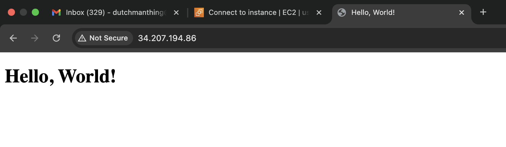
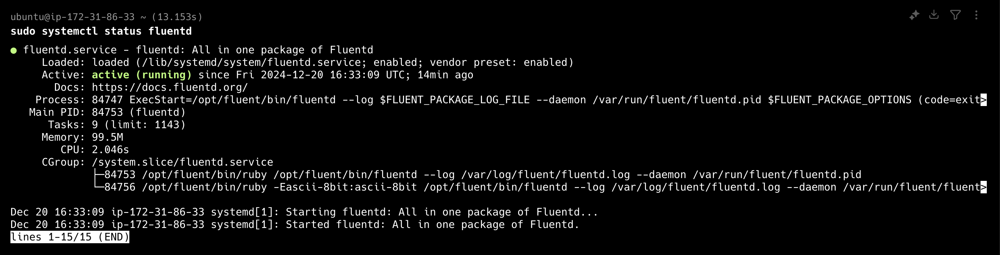
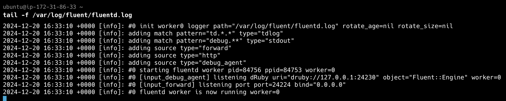

# Linux-Ansible-FluentD
automate the installation and configuration of a web server using Ansible

## How to use
1. Edit the below values in host.yaml
- ansible_host
- ansible_user
- and also change ansible_ssh_private_key_file path
2. `ansible-playbook -i hosts.yaml site.yml`

## Nginx Serve a Simple HTML Page
After the entire configuration is done.
Paste your Ip address in your browser, like the image below

## Working Fluentd Service

## Fluentd Logs

## Log management solution

Log management solution is implemented using logrotate, which is the standard Linux solution for log rotation. 
The configuration:
- Rotates logs daily
- Keeps 5 days of logs
- Compresses old logs to save space
- Handles log rotation gracefully with Nginx
- Automatically deletes logs older than 5 days